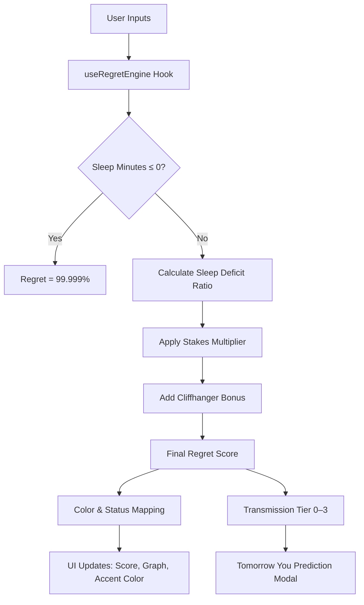

# One More Episode 🎬


## Basic Details
### Team Name: Strell


### Team Members
- Team Lead: AlRayyan Arshad - Model Engineering College, Thrikkakara
- Member 2: Pranav Santhosh - Model Engineering College, Thrikkakara

### Project Description
One More Episode is a hyper-precise, satirical "Sleep Regret Prediction Engine" that calculates the exact cost of watching *just one more episode* before bed. It uses a mathematically rigorous (and entirely tongue-in-cheek) regret formula to predict how badly Tomorrow You will suffer.

### The Problem (that doesn't exist)
Every night, millions of people face the devastating dilemma of whether to watch one more episode. They have absolutely zero tools to quantify the catastrophic consequences of this decision. How can anyone make a terrible decision without the proper data?

### The Solution (that nobody asked for)
A premium, Awwwards-grade web application that lets you configure your binge parameters — episode count, runtime, wake-up alarm, tomorrow's stakes, and cliffhanger intensity — and outputs a real-time **Regret Score** (0–100%) along with a snarky "Transmission from Tomorrow You" predicting your morning fate.

## Technical Details
### Technologies/Components Used
For Software:
- **Languages:** JavaScript (JSX)
- **Frameworks:** React 19, Vite 8
- **Libraries:** Tailwind CSS 4, Lucide React (icons)
- **Tools:** ESLint, Vite Dev Server

### Implementation
For Software:

# Installation
```bash
git clone https://github.com/alrayyan2157/onemore-episode.git
cd onemore-episode
npm install
```

# Run
```bash
npm run dev
```
The app will be available at `http://localhost:5173`.

# Build for Production
```bash
npm run build
npm run preview
```

### Project Documentation
For Software:

# Screenshots (Add at least 3)

*Add caption explaining what this shows*


*Add caption explaining what this shows*


*Add caption explaining what this shows*

# Diagrams

*Architecture of the Sleep Regret Engine — from user inputs to the final regret prediction*

### Project Demo
# Video
[Add your demo video link here]
*Explain what the video demonstrates*

# Additional Demos
[Add any extra demo materials/links]

## Team Contributions
- **AlRayyan Arshad**: [Specific contributions]
- **Pranav Santhosh**: [Specific contributions]

---
Made with ❤️ at TinkerHub Useless Projects 


